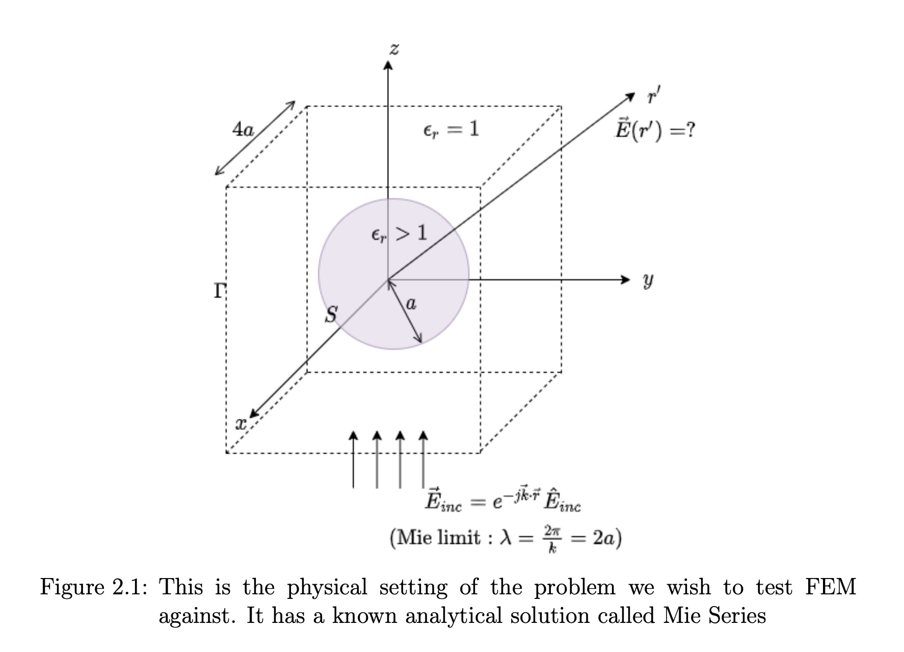
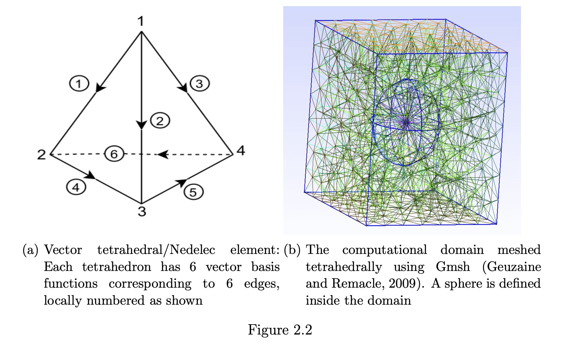
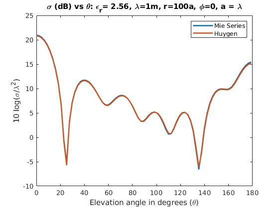

This repository contains sample C++ codes that simulate electromagnetic scattering for specialized applications in remote sensing. These codes were developed as part of a collaborative research project on remote sensing, and are public primarily to verify my background in C++ and MATLAB. We refrain from a detailed explanation of how these codes work in this readme file. 

However, we recommend reading our [documentation](https://sriramgkn.github.io/reports/FEM_3D_docum.pdf) and [thesis](https://sriramgkn.github.io/reports/Sriram_thesis_final.pdf) to understand the mathematics and physics of vector finite element methods in electromagnetics.

A sample result that our code can generate is the image that follows. In it, we propogate fields that the FEM generates in the near-field limit to a far-field limit using a mathematical version of [Huygen's principle](https://en.wikipedia.org/wiki/Huygens%E2%80%93Fresnel_principle). Then we compare this far-field with what is theoretically expected from [Mie theory](https://en.wikipedia.org/wiki/Mie_scattering). The plots then compare the two vector fields component-wise as well as the [radar cross section](https://en.wikipedia.org/wiki/Radar_cross_section).

The image below depicts the problem setting of the forward model. The knowns are the incident field (plane wavefront) and the permittivity of the scatterer. The target unknown is the total field (or equivalently the scattered field) a far-field point.

The image below depicts how we mesh the computational domain tetrehedrally using Gmsh, and the vector basis functions intrinsic to each tetrahedron (Nedelec element).

The image below validates our formalism and implementation of Huygen's principle via dyadic Green's functions.

